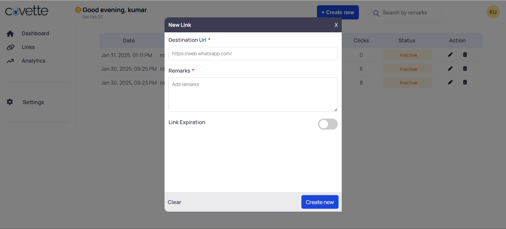

## TrimLink


A simple and efficient URL Shortener built with React (Frontend) and Node.js/Express (Backend) to generate, manage, and track short URLs.


# Deployment Link
Website Hosted here -> https://shorturl-rose.vercel.app/

## Features

- 🔗 Shorten long URLs quickly
- 📊 Track click counts and statuses
- 🗑️ CRUD operations: Create, Read, Update, Delete URLs
- 🔒 User authentication (JWT-based)
- 📆 Set expiration dates for shortened links
- 📋 Copy shortened links with a single click
- 📄 Pagination support for better link management

## Tech Stack

- **Frontend:** React, React Router, Axios, React-Toastify, React-Datepicker
- **Backend:** Node.js, Express, MongoDB, Mongoose, JWT Authentication, shortid
- **Styling:** Modules CSS 

## Installation

### Prerequisites

Make sure you have the following installed:

- Node.js (v14+ recommended)
- MongoDB (local or cloud instance)

### Clone the Repository

```sh
git clone https://github.com/S-kumar856/link_management_platform.git
cd link-management-platform
```

### Backend Setup

1. Navigate to the backend folder:
   ```sh
   cd backend
   ```
2. Install dependencies:
   ```sh
   npm install
   ```
3. Create a **.env** file and add the following:
   ```env
   PORT= your port number( ex- PORT = 8000)
   MONGO_URI=your_mongodb_connection_string
   JWT_SECRET=your_secret_key
   ```
4. Start the backend server:
   ```sh
   nodemon index.js
   or 
   npm run dev
   ```

### Frontend Setup

1. Navigate to the frontend folder:
   ```sh
   cd frontend
   ```
2. Install dependencies:
   ```sh
   npm install
   ```
3. Start the React application:
   ```sh
   npm run dev
   ```

## Usage

- Open `localhost link` in your browser.
- Register/Login to create and manage short URLs.
- Shorten any long URL and track its details.
- Copy the shortened link to share.
- Edit or delete URLs as needed.

## API Endpoints

| Method | Endpoint               | Description         |
| ------ | ---------------------- | ------------------- |
| POST   | `/api/user/register`   | Register a new user |
| POST   | `/api/user/login`      | Authenticate user   |
| GET    | `/api/url/AllLiks`     | Fetch all links     |
| POST   | `/api/url/createLinks`     | Create a short URL  |
| PUT    | `/api/url/updateLik/:id` | Update a short URL  |
| DELETE | `/api/url/deleteLink/:id` | Delete a short URL  |

## Contribution

Feel free to contribute to this project! Follow these steps:

1. Fork the repository.
2. Create a new branch (`git checkout -b feature-name`).
3. Commit your changes (`git commit -m 'Add feature'`).
4. Push to the branch (`git push origin feature-name`).
5. Open a Pull Request.

## Images




**Happy Coding! 🚀**